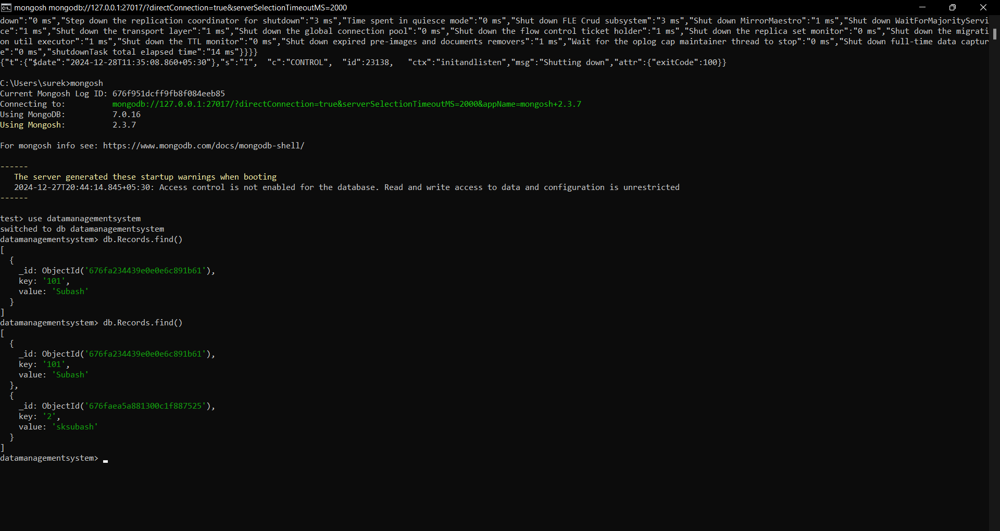

# Efficient Data Management System using Java Collections and MongoDb
   * A java based system utilizing **Collection Framework** and **MongoDb** for efficient data handling.

# Features:
   - CRUD operations using Java Collections
   - NoSQL database integration with mongoDb
   - High-speed data Retrieval

# Technologies used:
   - Java (Collection Framework)
   - Mongodb
   - Maven

# Screenshots:
   1. CRUD operations: 
                       
                       
                       
                       

   2. DATA:
            

# Installation & Usage:
   * Clone the repository: 
     git clone 
     https://github.com/subash19197/Efficient_Data_Management_System-Java
   * Install and configure MongoDB
   * Run the Java application using maven

# Future Enhancements:
   - Add REST API for remote access
   - Implement indexing for faster queries

# Author
   Subash.S.K
